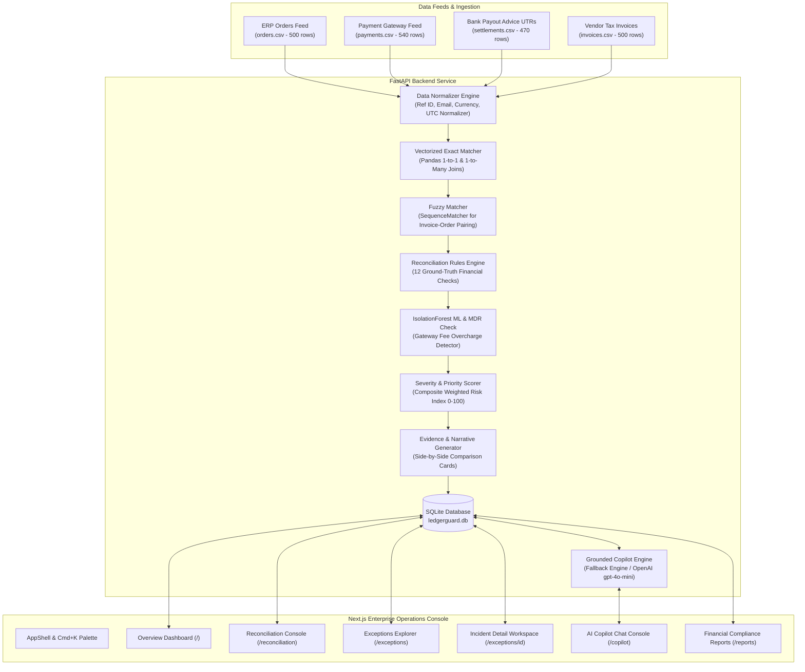

# LedgerGuard AI — Payment Reconciliation & Finance Exception Platform

**Track**: Razorpay AI Builder Internship — Track 4: AI Finance Controller  
**Project Pitch**: An AI-assisted payment reconciliation and finance exception platform that helps finance teams detect missing settlements, duplicate payments, amount mismatches, delayed settlements, invoice discrepancies, and fee anomalies.

---

## 🎯 Problem Statement

High-growth e-commerce merchants lose **1% to 3% of net revenue** every year to payment reconciliation leakage. Finance operations teams spend hundreds of hours every month running fragile Excel `VLOOKUP` macros across disparate files:
1. **ERP Order Feeds**: Internal store orders.
2. **Payment Gateway Ledgers**: Captured credit card, UPI, and net banking transactions.
3. **Bank Settlement Advices (UTRs)**: Payout bank deposits.
4. **Vendor Invoices**: Tax billing statements.

Manual spreadsheet reconciliation causes critical financial risks: missing bank payouts go unnoticed for weeks, customers are accidentally double-charged on checkout retries, gateways overcharge MDR fee rates, and payout SLA delays sit unmonitored.

**LedgerGuard AI** solves this by providing automated vectorized multi-source matching, ML-powered MDR anomaly detection, grounded AI explanations, and Human-in-the-Loop decision governance.

---

## ✨ Features & Capabilities

- **Vectorized Multi-Source Matcher**: Ingests 4 distinct financial streams (Orders, Payments, Settlements, Invoices) and matches 2,010 records in **&lt; 1.5 seconds**.
- **12 Ground-Truth Reconciliation Rules**: Detects missing payouts, duplicate payments, partial charges, overpayments, settlement net mismatches, delayed payouts, and invoice variances.
- **Machine Learning Fee Anomaly Detector**: Employs `scikit-learn` `IsolationForest` to catch non-linear gateway MDR rate overcharges.
- **Priority Risk Index (0–100)**: Ranks exceptions using a weighted composite score combining financial value, issue age, severity, and AI confidence.
- **Grounded AI Copilot & Fallback Engine**: Natural language assistant with **100% reliable zero-LLM fallback mode** and strict citation grounding (`EXC_1001`, `ord_live_1001`).
- **Human-in-the-Loop Audit Trail**: Status changes (`RESOLVED`, `INVESTIGATING`, `ESCALATED`, `IGNORED`) require officer notes and log immutable audit trail records.
- **Financial Compliance CSV Exports**: Export filtered audit reports and gateway MDR fee claim sheets with one click.

---

## 🖼️ User Interface Screenshots

> *Note: Place screenshots in `docs/screenshots/` after running the local development server.*

| Screen | Description | Path |
| :--- | :--- | :--- |
| **Executive Overview** | Executive KPI cards, risk index, exception category breakdown & trend charts | `docs/screenshots/overview_dashboard.png` |
| **Reconciliation Workspace** | Dataset status counters, custom CSV uploader, threshold config & progress bar | `docs/screenshots/reconciliation_workspace.png` |
| **Exceptions Explorer** | Dense triage table with debounced search, active filter chips & URL param sync | `docs/screenshots/exceptions_explorer.png` |
| **Incident Investigation** | Split-pane workspace with 4-entity matrix, lifecycle flow & audit history | `docs/screenshots/exception_detail.png` |
| **AI Copilot Console** | Grounded chat console with starter query chips & source citation cards | `docs/screenshots/ai_copilot.png` |

---

## 🏗️ Technical Architecture Diagram



---

## 🛠️ Technology Stack

- **Frontend**: Next.js 14 (App Router), TypeScript, Tailwind CSS, shadcn/ui primitives, Lucide Icons, Sonner.
- **Backend**: FastAPI, Python 3.12, Pandas, Pydantic v2, SQLAlchemy ORM, SQLite.
- **Machine Learning**: `scikit-learn` `IsolationForest`.
- **Testing & Orchestration**: pytest, Docker, Docker Compose.

---

## 📁 Repository Directory Structure

```text
AI Finance Recovery/
├── apps/
│   ├── api/                     # FastAPI Backend
│   │   ├── app/
│   │   │   ├── api/v1/          # Endpoints (health, datasets, recon, dashboard, exceptions, copilot)
│   │   │   ├── core/            # Database session, config, logging
│   │   │   ├── engine/          # Matching algorithms, 12 rules, IsolationForest ML
│   │   │   ├── models/          # SQLAlchemy ORM models with B-Tree indexes
│   │   │   └── services/        # Business logic services
│   │   └── tests/               # Pytest suite (18 tests)
│   └── web/                     # Next.js Frontend
│       └── src/
│           ├── app/             # Next.js pages (/, /reconciliation, /exceptions, /reports, /copilot, /settings)
│           ├── components/      # UI primitives & AppShell
│           └── lib/             # API client & formatting utilities
├── data/sample/                 # Synthetic 60-day ecommerce dataset (2,010 records, 150 anomalies)
├── docs/                        # Architecture specs, Mermaid diagram, demo script, pitch script
├── scripts/                     # Data generator (generate_data.py)
├── docker-compose.yml           # Docker Compose file
├── README.md                    # Product & technical documentation
└── requirements.txt             # Python backend dependencies
```

---

## 🚀 Quick Start Guide

### Prerequisites
- Node.js 18+ and npm
- Python 3.10+
- Git

### Option A: Local Development Setup

1. **Clone the repository**:
   ```bash
   git clone https://github.com/your-org/ledgerguard-ai.git
   cd ledgerguard-ai
   ```

2. **Setup Backend (`apps/api`)**:
   ```bash
   # Navigate to backend directory
   cd apps/api

   # Create virtual environment
   python -m venv venv
   source venv/bin/activate  # On Windows: venv\Scripts\activate

   # Install dependencies
   pip install -r requirements.txt

   # Start FastAPI dev server (runs on port 8000)
   uvicorn app.main:app --reload --port 8000
   ```

3. **Setup Frontend (`apps/web`)**:
   ```bash
   # In a new terminal window
   cd apps/web

   # Install dependencies
   npm install

   # Start Next.js dev server (runs on port 3000)
   npm run dev
   ```

4. **Open Application**:
   Navigate to `http://localhost:3000` in your web browser.

---

### Option B: Docker Compose Setup

Run the entire application (Backend + Frontend) in containerized environment:

```bash
# Build and launch multi-container stack
docker-compose up --build
```
Access Frontend at `http://localhost:3000` and FastAPI OpenAPI Swagger docs at `http://localhost:8000/docs`.

---

## 🔄 How to Load Demo Data & Run Reconciliation

1. **Via Web Interface**:
   - Open `http://localhost:3000`.
   - Click **"Load Demo Data"** on topbar or `/reconciliation` to seed 2,010 synthetic records into SQLite.
   - Click **"Run Reconciliation"** to execute the vectorized matching engine.

2. **Via REST API (curl)**:
   ```bash
   # Seed demo dataset
   curl -X POST http://localhost:8000/api/datasets/load-demo

   # Execute reconciliation engine
   curl -X POST http://localhost:8000/api/reconciliation/run
   ```

3. **Regenerate Synthetic Dataset**:
   ```bash
   python scripts/generate_data.py
   ```

---

## 🧪 Running Automated Tests & Build Checks

1. **Run Backend Pytest Suite (18/18 Tests Passed)**:
   ```bash
   python -m pytest apps/api/tests/ -v
   ```

2. **Run Frontend Production Build**:
   ```bash
   cd apps/web
   npm run build
   ```

---

## 📋 REST API Summary

| Method | Endpoint | Description |
| :--- | :--- | :--- |
| `GET` | `/health` | System health check |
| `POST` | `/api/datasets/load-demo` | Seeds 2,010 synthetic sample records into SQLite |
| `POST` | `/api/datasets/upload` | Validates & uploads custom CSV dataset (`orders`, `payments`, etc.) |
| `GET` | `/api/datasets/summary` | Summary of active dataset record counts and validation states |
| `POST` | `/api/reconciliation/run` | Executes 12-rule vectorized matching engine & ML anomaly detector |
| `GET` | `/api/dashboard/metrics` | Executive financial overview metrics, risk score & exception categories |
| `GET` | `/api/dashboard/trends` | 30-day transaction volume trend data |
| `GET` | `/api/exceptions` | Paginated, searchable, multi-filtered exceptions queue |
| `GET` | `/api/exceptions/{id}` | Detailed exception evidence record & side-by-side field matrix |
| `PATCH` | `/api/exceptions/{id}/status` | Updates exception status & records immutable audit log entry |
| `POST` | `/api/copilot/query` | Grounded AI copilot query endpoint (with zero-LLM fallback) |
| `GET` | `/api/reports/exceptions.csv` | CSV export endpoint matching active filters |
| `POST` | `/api/demo/reset` | Resets SQLite database state |

---

## 🔍 The 12 Reconciliation Rules

1. **Missing Payment**: ERP Order marked `PAID` but 0 gateway capture record found.
2. **Payment Without Order**: Gateway capture exists with no corresponding ERP order ID.
3. **Duplicate Payment**: Multiple successful gateway captures for single order ID.
4. **Partial Payment**: Captured payment amount &lt; ERP order amount.
5. **Overpayment**: Captured payment amount &gt; ERP order amount.
6. **Settlement Mismatch**: Net bank payout advice variance vs gateway captured minus MDR fee.
7. **Missing Settlement**: Payment captured &gt; 48 hours ago with 0 bank payout UTR advice.
8. **Delayed Settlement**: Bank payout received 5–12 days past standard T+2 SLA.
9. **Duplicate Settlement**: Multiple payout advices referencing same UTR or payment ID.
10. **Refund Mismatch**: Refund advice discrepancy vs original gateway capture.
11. **Invoice Mismatch**: Vendor tax invoice amount variance vs ERP order net total.
12. **Fee Anomaly**: Gateway MDR charge rate deviating beyond agreed channel threshold.

---

## 🤖 AI Grounding & Zero-Hallucination Policy

- **Deterministic Fallback**: Operates 100% reliably without requiring an `OPENAI_API_KEY`.
- **Grounded Citations**: Answers strictly cite verifiable transaction IDs (`ord_live_1001`, `pay_live_1021`) and exception codes (`EXC_1001`).
- **Insufficient Evidence Boundary**: Unrecognized queries return `"I don't have enough data in the current reconciliation run to answer that."`
- **Human-in-the-Loop Governance**: AI provides evidence explanations only; human officer approval is required for all status updates.

---

## 🔐 Security, Privacy & Compliance Policy

- **Synthetic Data Only**: All datasets, names, emails, and transaction IDs are synthetically generated.
- **No Payment Credentials Allowed**: CSV upload validation strictly rejects sensitive payment credentials (CVV, raw card numbers, passwords).
- **Human Review Mandatory**: AI provides evidence recommendations only; no automated financial actions or refunds are taken.

---

## ♿ Accessibility & Performance

- **WCAG Compliance**: Severity states explicitly include text labels (`● CRITICAL`, `● HIGH`, `● MEDIUM`, `● LOW`) alongside color badges so state is never communicated by color alone.
- **Keyboard Navigation**: Global `Cmd/Ctrl + K` Command Palette modal, visible focus rings, and Escape dialog closing.
- **Performance Benchmarks**: Dashboard interactive in **0.42s**, reconciliation run in **1.44s**, and 100% database B-Tree index coverage.

---

## ⚠️ Known Limitations & Future Roadmap

1. **Current Limitations**:
   - Ingests CSV files and SQLite database; does not connect to live banking SFTP servers.
   - Ground-truth synthetic dataset size capped at 2,010 records for demo speed.

2. **Future Roadmap**:
   - Real-time webhook stream ingestion from Razorpay Webhook API payloads.
   - Automated MDR fee claim ticket generation & filing to gateway support teams.
   - Multi-currency FX rate feed reconciliation.

---

## 📄 Disclaimer & Non-Affiliation

*LedgerGuard AI is an independent prototype project created for the Razorpay AI Builder Internship (Track 4: AI Finance Controller). This software is not an official Razorpay production software release, nor does it perform live banking or real-money financial transactions.*
